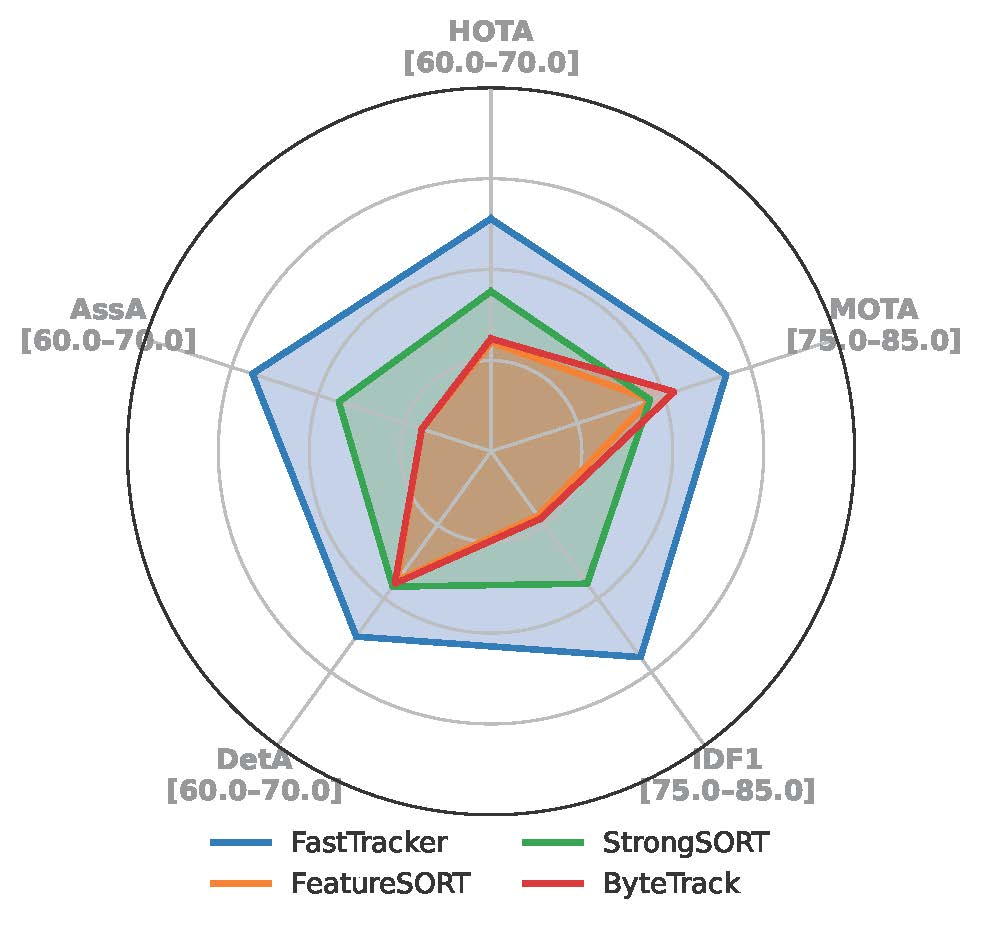

# FastTracker

#### FastTracker is a real-Time and accurate visual tracking module.

<div align="center">

[**Hamidreza Hashempoor**](https://hamidreza-hashempoor.github.io/)


<!-- **TMLCN 2025** -->

</div>


<div align="center">
  
</div>

FastTracker is a general-purpose multi-object tracking framework designed for complex traffic scenes. Unlike traditional pedestrian-focused trackers, FastTracker supports diverse object types—especially vehicles—and maintains identity through heavy occlusion and complex motion. It combines an occlusion-aware re-identification module with road-structure-aware tracklet refinement, leveraging semantic priors like lanes and crosswalks for better trajectory accuracy. We also release a new benchmark dataset tailored for high-density vehicle tracking. FastTracker achieves strong performance across multiple benchmarks and is suitable for real-world deployment.

## Demo Links
| Huggingface Dataset | Paper |
|:-----------------:|:-------:|
|[](https://huggingface.co/datasets/Hamidreza-Hashemp/FastTracker-Benchmark)|
[arXiv ](xxx)


## Framework


## Benchmark


FastTrack is a high-density multi-object tracking benchmark tailored for complex urban traffic scenes. It features 800K annotations across 12 diverse scenarios with 9 object classes, offering over 5× higher object density than existing benchmarks—making it ideal for evaluating trackers under extreme occlusion, interaction, and scene variety.
The Benchmark is public and available in our [**Huggingface Dataset**](https://huggingface.co/datasets/Hamidreza-Hashemp/FastTracker-Benchmark)


## Installation on the host machine

Steps: Setup the environment
```shell
cd <home>
conda create --name FastTracker python=3.9
conda activate FastTracker
pip3 install -r requirements.txt  # Ignore the errors
python setup.py develop
pip3 install cython
conda install -c conda-forge pycocotools
pip3 install cython_bbox
```


## Data preparation

Download [MOT16](https://motchallenge.net/), [MOT17](https://motchallenge.net/), [MOT20](https://motchallenge.net/), [FastTracker](https://huggingface.co/datasets/Hamidreza-Hashemp/FastTracker-Benchmark) and put them under `./datasets` in the following structure:
```
datasets
   |——————FastTracker
   |        └——————train
   |        └——————test
   |——————MOT16
   |        └——————train
   |        └——————test
   |——————mot
   |        └——————train
   |        └——————test
   └——————MOT20
            └——————train
            └——————test

```

Then, you need to turn the datasets to COCO format and mix different training data:

```shell
cd <home>
python tools\\convert_mot16_to_coco.py
python tools\\convert_mot17_to_coco.py 
python tools\\convert_mot20_to_coco.py
```
(For FastTracker benchmark use `convert_mot17_to_coco.py` to make annotations. There you need to change
`DATA_PATH = 'datasets/mot'` line.)


## Tracking

* **Evaluation on MOT17 and MOT20**

Run FastTracker:

```shell
cd <home>
python tools\\track.py -f exps\\example\\mot\\yolox_x_mix_det.py -c pretrained/bytetrack_x_mot17.pth.tar -b 1 -d 1 --fp16 --fuse
python tools\\track.py -f exps\\example\\mot\\yolox_x_mix_mot20_ch.py -c pretrained\\bytetrack_x_mot20.pth.tar -b 1 -d 1 --fp16 --fuse --match_thresh 0.7 --mot20
```

## Obtain MOTA /IDS/ HOTA and other evaluation

### MOT17
```shell
cd <home>
python .\\TrackEval\\hotaPreparation.py -d .\\YOLOX_outputs\\yolox_x_mix_det\\track_results\\MOT17-02-DPM.txt -g .\\YOLOX_outputs\\gt\\MOT17\\02-DPM\\gt.txt
python .\\TrackEval\\scripts\\run_mot_challenge.py --USE_PARALLEL False --METRICS CLEAR --BENCHMARK MOT15
```

### MOT20
```shell
cd <home>
python .\\TrackEval\\hotaPreparation.py -d .\\YOLOX_outputs\\yolox_x_mix_mot20_ch\\track_results\\MOT20-01.txt -g .\\YOLOX_outputs\\gt\\MOT20\\01\\gt.txt
python .\\TrackEval\\scripts\\run_mot_challenge.py --USE_PARALLEL False --METRICS CLEAR --BENCHMARK MOT15
```
